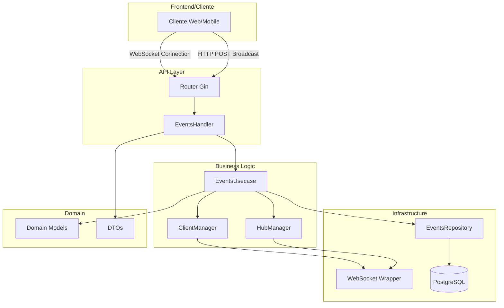
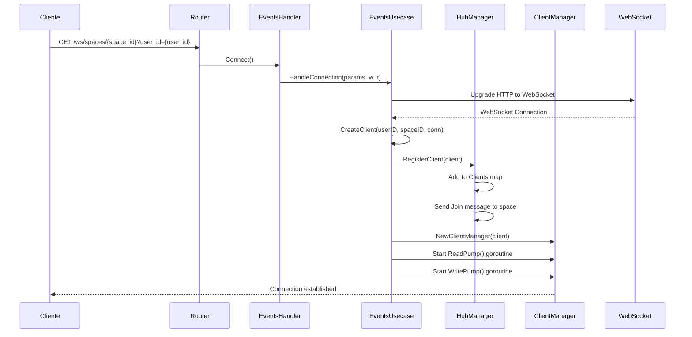
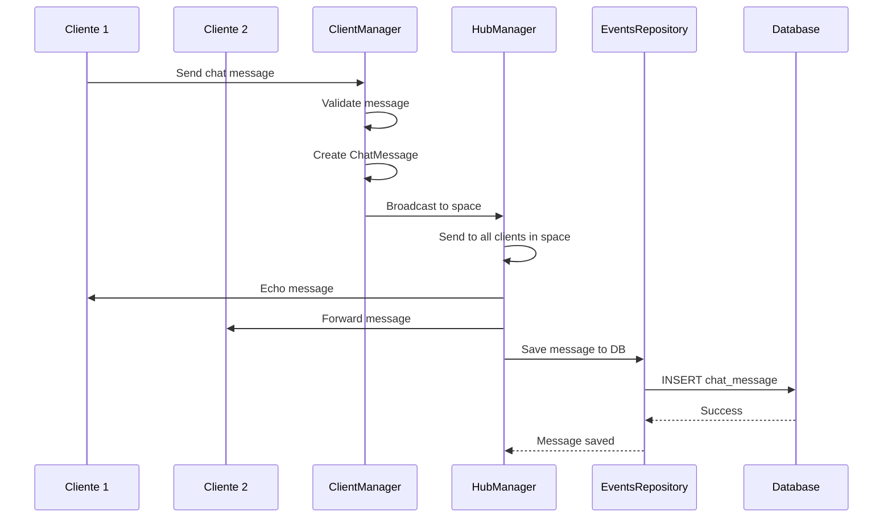
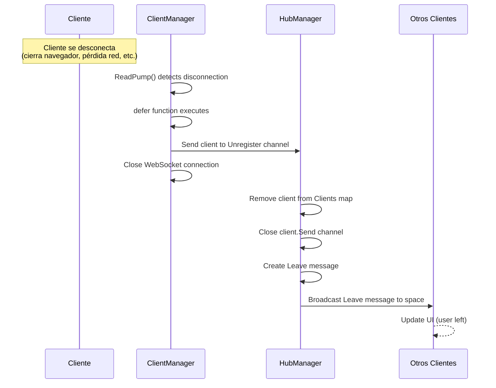
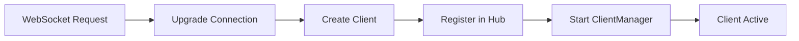
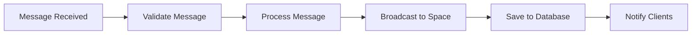
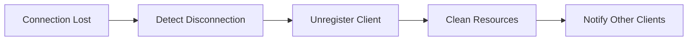

# 🚀 Arquitectura de Eventos en Tiempo Real - CPI Hub API

## 📋 Resumen Ejecutivo

Esta aplicación implementa un sistema de eventos en tiempo real usando WebSockets con una arquitectura limpia que separa responsabilidades entre capas. El sistema permite comunicación en tiempo real entre usuarios dentro de espacios específicos.

## 🏗️ Arquitectura General



## 🔄 Flujo de Conexión WebSocket



## 💬 Flujo de Mensajes de Chat



## 🔌 Flujo de Desconexión



## 📁 Estructura de Archivos y Responsabilidades

### 🎯 **Domain Layer** (`internal/core/domain/`)
- **`events.go`**: Modelos de dominio (Client, Hub, EventMessage, ChatMessage, etc.)
- **`repositories.go`**: Interfaces de repositorios

### 🔧 **Use Cases** (`internal/core/usecase/events/`)
- **`events_usecase.go`**: Lógica de negocio principal
  - `HandleConnection()`: Maneja conexiones WebSocket
  - `Broadcast()`: Procesa mensajes de chat
  - `CreateClient()`: Crea clientes
  - `RegisterClient()`: Registra clientes en el hub

- **`hub_manager.go`**: Gestión del hub central
  - `Run()`: Loop principal del hub
  - `BroadcastChatMessage()`: Difunde mensajes de chat
  - `broadcastToSpace()`: Envía mensajes a espacios específicos

- **`client_manager.go`**: Gestión individual de clientes
  - `ReadPump()`: Lee mensajes del cliente
  - `WritePump()`: Escribe mensajes al cliente
  - `handleMessage()`: Procesa mensajes recibidos

### 🌐 **Infrastructure Layer**

#### **Handlers** (`internal/infrastructure/entrypoint/handlers/events/`)
- **`events.go`**: Endpoints HTTP
  - `Connect()`: Establece conexión WebSocket
  - `Broadcast()`: Envía mensajes via HTTP

#### **Adapters** (`internal/infrastructure/adapters/`)
- **`websocket/websocket_wrapper.go`**: Wrapper para Gorilla WebSocket
- **`repositories/postgres/events/events_repository.go`**: Persistencia de mensajes

## 🔄 Estados del Sistema

### 1. **Inicialización**
```mermaid
graph LR
    A[App Start] --> B[Create HubManager]
    B --> C[Start Hub.Run() goroutine]
    C --> D[Hub Ready]
```

### 2. **Conexión de Cliente**


### 3. **Manejo de Mensajes**


### 4. **Desconexión**


## 🚦 Tipos de Mensajes

| Tipo | Propósito | Cuándo se Envía |
|------|-----------|-----------------|
| `join` | Notificar entrada de usuario | Al conectarse |
| `leave` | Notificar salida de usuario | Al desconectarse |
| `chat` | Mensaje de chat | Al enviar mensaje |
| `ping` | Mantener conexión viva | Periódicamente |
| `pong` | Respuesta a ping | En respuesta a ping |
| `error` | Mensaje de error | En caso de error |

## 🔧 Configuración y Timeouts

```go
const (
    writeWait      = 10 * time.Second  // Timeout para escribir
    pongWait       = 60 * time.Second  // Timeout para pong
    pingPeriod     = 54 * time.Second  // Intervalo de ping
    maxMessageSize = 512               // Tamaño máximo de mensaje
)
```

## 🎯 Endpoints Disponibles

### WebSocket
- **`GET /v1/ws/spaces/{space_id}?user_id={user_id}`**
  - Establece conexión WebSocket
  - Parámetros: `space_id` (path), `user_id` (query)

### HTTP REST
- **`POST /v1/ws/spaces/{space_id}/broadcast`**
  - Envía mensaje de chat via HTTP
  - Body: `{"message": "texto", "user_id": "id", "username": "name"}`

## 🔒 Consideraciones de Seguridad

1. **Validación de Parámetros**: Todos los parámetros son validados
2. **Límites de Mensaje**: Tamaño máximo de 512 bytes
3. **Timeouts**: Conexiones se cierran automáticamente si no responden
4. **Limpieza de Recursos**: Recursos se liberan automáticamente

## 📊 Métricas y Logging

El sistema incluye logging detallado para:
- Conexiones y desconexiones
- Errores de WebSocket
- Mensajes enviados/recibidos
- Problemas de difusión

## 🚀 Escalabilidad

La arquitectura actual está diseñada para:
- **Múltiples espacios**: Cada espacio maneja sus propios clientes
- **Concurrencia**: Uso de goroutines para manejo asíncrono
- **Limpieza automática**: Recursos se liberan automáticamente
- **Tolerancia a fallos**: Manejo robusto de errores de conexión

---

*Esta arquitectura proporciona una base sólida para comunicación en tiempo real escalable y mantenible.*
